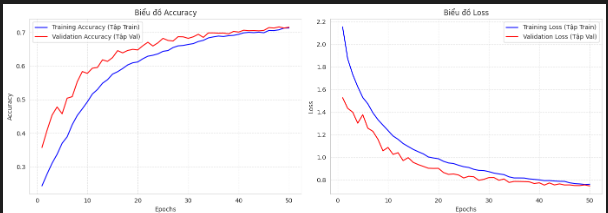
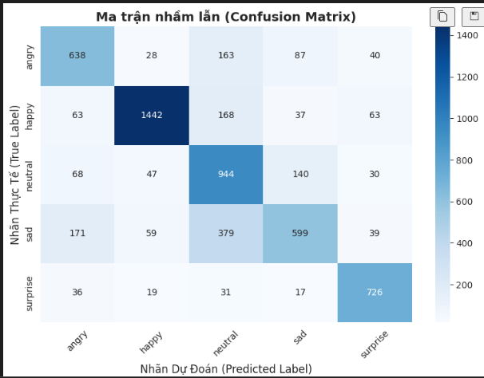

# 🎭 Hệ thống Nhận diện Cảm xúc Khuôn mặt (Facial Emotion Recognition - FER)


Hệ thống Deep Learning nhận diện 5 trạng thái cảm xúc chính từ ảnh khuôn mặt. Dự án xây dựng từ tiền xử lý ảnh, huấn luyện mô hình, đánh giá hiệu năng đến giao diện Web tương tác.

---

## 1. 📌 Giới thiệu về dự án

Bài toán nhận diện cảm xúc khuôn mặt (Facial Emotion Recognition) phục vụ trong giao tiếp người-máy, y tế tâm lý và phân tích trải nghiệm người dùng. Dự án này nhằm tạo ra một hệ thống AI có khả năng phân loại 5 cảm xúc từ khuôn mặt: Angry, Happy, Neutral, Sad và Surprise.

**Mục tiêu chính:**
- Xây dựng pipeline tiền xử lý ảnh và tăng cường dữ liệu
- So sánh các kiến trúc CNN và Transfer Learning
- Xuất mô hình tốt nhất để chạy realtime trên Web App

---

## 2. 📊 Dữ liệu sử dụng (Dataset)

Dự án sử dụng bộ dữ liệu **FER-2013** hoặc bộ dữ liệu tương tự gồm ảnh mặt xám kích thước 48x48.

* **Định dạng ảnh:** Grayscale 48x48 pixels
* **Số lượng nhãn:** 5 lớp cảm xúc
* **Nhãn:** Angry, Happy, Neutral, Sad, Surprise
* **Đặc điểm:** Dữ liệu ảnh có tính nhiễu cao do biểu cảm mờ, góc chụp khác nhau và ánh sáng thay đổi, nên cần xử lý kỹ trước khi huấn luyện

---

## 3. ⚙️ Quy trình huấn luyện và xử lý dữ liệu

Dự án được tổ chức theo hai giai đoạn chính:

### Giai đoạn 1: Tiền xử lý & EDA
* **Tiền xử lý ảnh:** Chuyển ảnh về grayscale, chuẩn hóa kích thước và chuẩn hóa giá trị pixel
* **Data Augmentation:** Sử dụng ImageDataGenerator với xoay, dịch chuyển, zoom, lật ngang và thay đổi độ sáng
* **Cân bằng dữ liệu:** Áp dụng Class Weights hoặc oversampling khi cần
* **Khám phá dữ liệu:** Vẽ histograms, số lượng mỗi lớp và phân bố nhãn

### Giai đoạn 2: Huấn luyện & đánh giá mô hình
* **Chia dữ liệu:** Chia train/validation/test hợp lý
* **Xây dựng mô hình:** So sánh giữa **Custom CNN**, **MobileNetV2** và **VGG16**
* **Callback:** Sử dụng EarlyStopping, ReduceLROnPlateau, ModelCheckpoint
* **Đánh giá:** Confusion Matrix, Classification Report, Accuracy, Loss
* **Xuất mô hình:** Lưu file .h5 để dùng tiếp trong Web App

---

## 4. 📸 Ảnh Demo

| Ảnh Demo | Mô tả |
| :--- | :--- |
| .png) | Nhận diện ảnh cảm xúc bình thường |
| .png) | Nhận diện ảnh cảm xúc bất ngờ |
| .png) | Nhận diện ảnh cảm xúc vui vẻ |
| .png) | Nhận diện ảnh cảm xúc tức giận |
| .png) | Nhận diện ảnh cảm xúc buồn bã |
| .png) | Nhận diện mặt cảm xúc bình thường |
| .png) | Nhận diện mặt cảm xúc buồn bã |
| .png) | Nhận diện mặt cảm xúc tức giận |
| .png) | Nhận diện mặt cảm xúc vui vẻ |
| .png) | Nhận diện mặt cảm xúc bất ngờ |

---

## 5. 🏆 Đánh giá và kết quả

Sau quá trình thử nghiệm nhiều mô hình, kết quả tốt nhất đạt được:

* **Accuracy trên tập Test:** 71.93%
* **Loss:** 0.7338

### So sánh mô hình

| Mô hình | Validation Accuracy | Ghi chú |
| :--- | :---: | :--- |
| Custom CNN | 57.5% | Nhỏ, phù hợp cho Web |
| MobileNetV2 | 29.8% | Transfer Learning |
| VGG16 | 29.8% | Mô hình sâu hơn |

**Nhận xét:**
* Mô hình hoạt động tốt với cảm xúc rõ rệt như Happy và Surprise
* Cần tối ưu thêm cho cảm xúc trung lập và buồn bã

### Biểu đồ kết quả

| Accuracy và Loss | Confusion Matrix |
| :---: | :---: |
|  |  |

---

## 6. 🛠️ Công nghệ sử dụng

* **Ngôn ngữ:** Python 3.10+
* **Deep Learning:** TensorFlow, Keras
* **Xử lý dữ liệu:** NumPy, Pandas
* **Xử lý ảnh:** OpenCV, Pillow
* **Trực quan hóa:** Matplotlib, Seaborn
* **Web App:** Flask

---

## 7. 💻 Cài đặt

### 1. Clone repository:
```bash
git clone https://github.com/NguyenNgocTuanAnh09/emotion-recognition.git
cd emotion-recognition
```

### 2. Tạo môi trường ảo:
```bash
# Windows
python -m venv venv
venv\Scripts\activate

# macOS / Linux
python -m venv venv
source venv/bin/activate
```

### 3. Cài đặt dependencies:
```bash
pip install --upgrade pip
pip install -r requirements.txt
```

---

## 8. 🚀 Cách chạy dự án

### A. Chạy Web App:
```bash
cd app
python web.py
```
Mở trình duyệt tại: http://localhost:5000

### B. Chạy notebook huấn luyện:
```bash
jupyter notebook notebooks/Emotion_Recognition.ipynb
```

---

## 9. 📁 Cấu trúc dự án

```
emotion-recognition/
├── README.md
├── requirements.txt
├── .gitignore
├── app/
│   └── web.py
├── models/
│   └── final_fer_model.h5
├── notebooks/
│   └── Emotion_Recognition.ipynb
└── images/
    ├── AccuracyAndLoss.png
    ├── MatrixConfusion.png
    ├── DemoPicture1(Neutral).png
    ├── DemoPicture2(Surprise).png
    ├── DemoPicture3(Happy).png
    ├── DemoPicture4(Angry).png
    ├── DemoPicture5(Sad).png
    ├── DemoFace1(Neutral).png
    ├── DemoFace2(Sad).png
    ├── DemoFace3(Angry).png
    ├── DemoFace4(Happy).png
    └── DemoFace5(Surprise).png
```

---

## 10. 👨‍💻 Tác giả

**Nguyễn Ngọc Tuấn Anh**

* **Chuyên ngành:** Hệ thống Thông tin (Mã ngành: 64HTTT4)
* **Đơn vị:** Trường Đại học Thủy lợi (TLU) - Hà Nội
* **Liên hệ:** ngoctuananh09@gmail.com

---

## 11. 📝 Ghi chú

* Cập nhật lại đường dẫn Web App nếu sử dụng framework khác
* Thêm số liệu chính xác vào bảng so sánh khi có kết quả thực tế
* Repository: https://github.com/NguyenNgocTuanAnh09/emotion-recognition


